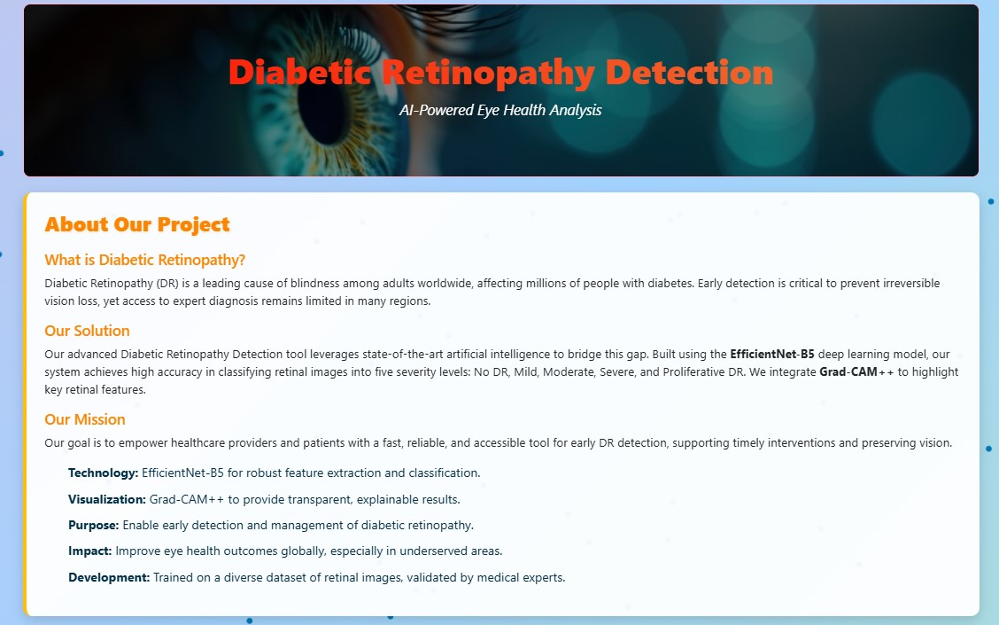
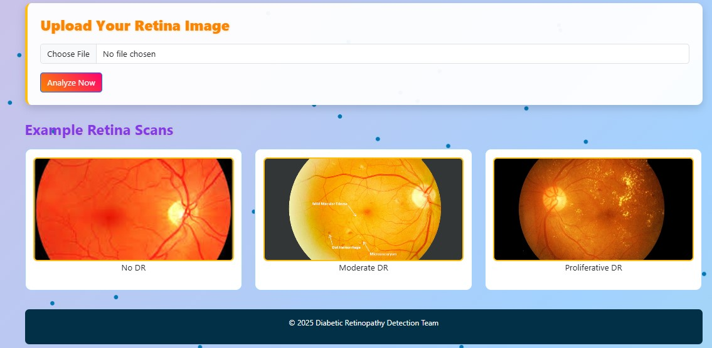
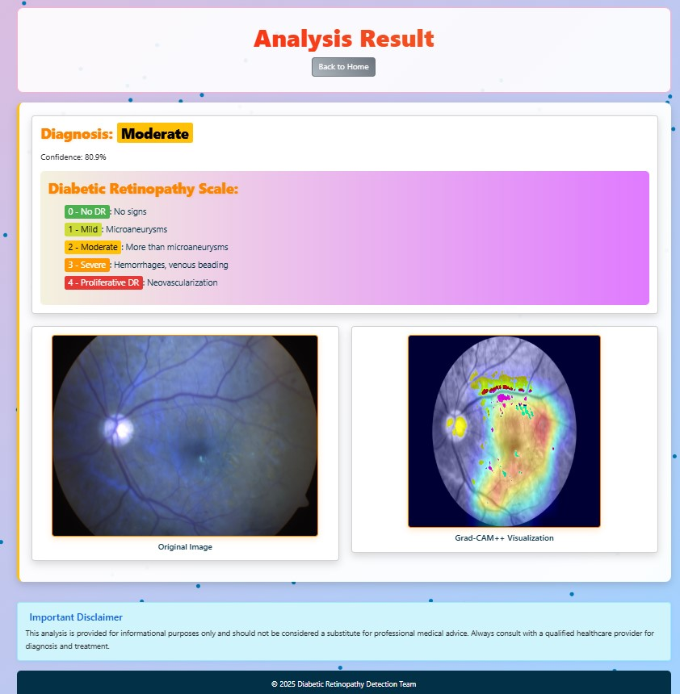

# Diabetic Retinopathy Detection with Grad-CAM++

<div align="center">
  
  
  <p><strong>Home Page of the Application</strong></p>

  
  <p><strong>Prediction Results Page</strong></p>
</div>

**Diabetic Retinopathy Detection with Grad-CAM++** is a deep learning-based web application for detecting diabetic retinopathy (DR) from retinal images. It emphasizes **transparent AI** by combining high-performance classification using **EfficientNet-B5** with **Grad-CAM++** for visual explainability.

This project is inspired by the need for early, accurate, and explainable DR screening — especially in under-resourced clinical settings.


---

## 🌟 Key Features

- 🔬 **Deep Learning Classification**: EfficientNet-B5 trained on retinal fundus images to detect DR severity.
- 🔍 **Explainable AI**: Grad-CAM++ heatmaps to show *why* the model makes its prediction.
- 🌐 **Web Application**: Upload an image and instantly get prediction, confidence, and a visualization.
- 📈 **Data Visualization**: t-SNE plots and confidence scores for transparency.
- 💻 **Modern UI**: Built with Flask, Bootstrap, AOS animations, and particles.js for a smooth experience.

---

## 🧪 Tools & Techniques

### ⚙️ Tools Used

- **Programming Language**: Python 3.10+
- **Model Framework**: PyTorch
- **Web Backend**: Flask
- **Frontend**: HTML, CSS, Bootstrap 5, AOS, Particles.js
- **Visualization**: Grad-CAM++, t-SNE (via scikit-learn), Matplotlib
- **Image Processing**: OpenCV, PIL, NumPy
- **Data Handling**: Pandas

### 🧠 Techniques

- ✅ **Model**: EfficientNet-B5 fine-tuned on the APTOS 2019 dataset
- 🔥 **Explainability**: Grad-CAM++ overlays to highlight model attention areas
- 📊 **Evaluation**: Cohen’s Kappa Score, Accuracy
- 🖼️ **Preprocessing**: Image augmentation, resizing, and normalization
- 📉 **Feature Analysis**: t-SNE on intermediate features for cluster visualization

---

## 📁 Dataset & Model

- 📊 **Dataset**: [APTOS 2019 Blindness Detection (Kaggle)](https://www.kaggle.com/datasets/mariaherrerot/aptos2019)
- 📥 **Pretrained Model Weights** (Hosted on Hugging Face):
  [Download best_model.pth](https://huggingface.co/thor15/Diabetic-Retinopathy-Detection-with-Gradcampp/blob/main/best_model.pth)

Place the downloaded `best_model.pth` file into your project’s `models/` directory (create if needed) or you can directly save in current directory.

---

### ✅ Prerequisites

- Python 3.10+
- Git
- pip (Python package installer)

---

### 📦 Step-by-Step Setup

1. **Clone the Repository**:
   ```bash
   git clone https://github.com/Dishant-Chouhan/Diabetic-Retinopathy-Detection-with-Gradcampp.git
   cd Diabetic-Retinopathy-Detection-with-Gradcamppp

2. **(Optional) Create and Activate a Virtual Environment**:

   It's a good practice to use a virtual environment to manage dependencies:

   ```bash
   python3.10 -m venv venv
   source venv/bin/activate         # For Linux/macOS
   venv\Scripts\activate            # For Windows
   
3. **Install Required Packages**:

   Make sure you're in the project root directory and run:

   ```bash
   pip install -r requirements.txt

4. **Download the model**:
    [Download best_model.pth](https://huggingface.co/thor15/Diabetic-Retinopathy-Detection-with-Gradcampp/blob/main/best_model.pth)


5. **Run the Flask Web App**:

   Launch the application locally using:

   ```bash
   python app.py


